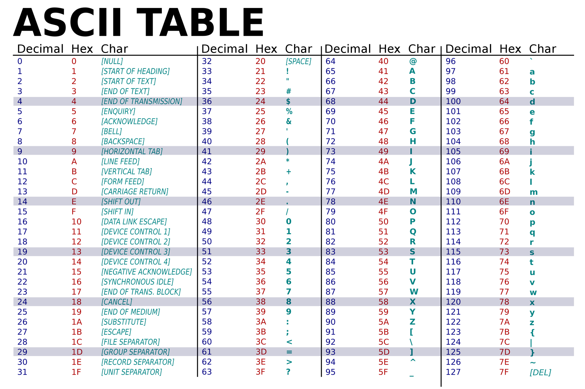

# Primitive Data Types

There are 8 primitive data types (note 1 byte = 8bits). A data with n bits can represent up to 2<sup>n</sup> different numbers.

- **byte**: 1 byte integer, range \[−2<sup>7</sup> , 2<sup>7</sup> − 1\]
- **short**: 2 byte integer, range \[−2<sup>15</sup> , 2<sup>15</sup> − 1\]
- **int**: 4 byte integer, range \[−2<sup>31</sup> , 2<sup>31</sup> − 1\]
- **long**: 8 byte integer, range \[−2<sup>63</sup> , 2<sup>63</sup> − 1\]
- **float**: single-precision floating-point number, around 6-7 significant digits, Range: ±10<sup>±37</sup>
- **double**: double-precision floating-point number, around 14-15 significant digits, Range: ±10<sup>±308</sup>
- **boolean**: a Boolean (it’s not spelled bool)
- **char**: 16-bit unicode character, encoded via ASCII code



### Exercise:

What is the output of the following snippet?

```Java
public class Test {
    public static void main(String[] args)
    {
    	char a = '2' + '0';
        System.out.println(a);
    }
}
```

## Overflow & Underflow

In Java, overflow and underflow can occur when working with numerical data types, such as `int`, `long`, `float`, and `double`. Overflow occurs when a value exceeds the maximum representable value for its data type, while underflow occurs when a value falls below the minimum representable value for its data type.

For example, consider the following code:

```java
int a = 2147483647;    // max value for an int, 2^31
a = a + 1;             // a now overflows, becoming -2147483648 (the min value for an int)
```

In this example, the variable a is initialized with the maximum value representable by an int. When we attempt to increment it by 1, it overflows and becomes the minimum value for an int, which is negative.

Similarly, underflow can occur when subtracting from the minimum representable value of a data type. For example:

```java
int b = -2147483648;   // min value for an int, 2^31 - 1
b = b - 1;             // b now underflows, becoming 2147483647 (the max value for an int)
```

In this example, the variable b is initialized with the minimum value representable by an int. When we attempt to subtract 1 from it, it underflows and becomes the maximum value for an int.

Overflow and underflow can also occur when working with floating-point data types, such as float and double. In these cases, the overflow and underflow conditions are different, and depend on the exponent of the floating-point number.

To prevent overflow and underflow, it's important to ensure that the values being used and calculated with are within the range of their respective data types. In some cases, you may need to use a larger data type to accommodate larger values. You can also use error-checking techniques, such as range checking and boundary checking, to detect and prevent overflow and underflow conditions.

## Conversions

- explicit conversion/casting: usually done by putting data type in front of variables/values
    
    - e.g. `double d = ((double) 1) / ((double) 2);`
- implicit conversion/casting: happens when do arithmetic among mixed types.
    
    - e.g. `double d = 5;`, `'a' + 1`
    - the order of implicit conversion


In implicit conversion, widening conversion is automatic but narrowing conversion is not (compilation errors). Though narrowing conversion is allowed in explicit conversion in terms of grammar, it may lead to unexpected behaviors due to underflow/overflow.

### Exercise:

What is the output of the following snippet?

```Java
public class Test {
    public static void main(String[] args)
    {
        System.out.println('a' + 13); // explicit or implicit conversion?
        System.out.println((char) ('a' + 13)); // explicit or implicit conversion?
    }
}
```

## Operations

- **Arithmetic operations** are used to perform basic mathematical calculations, e.g. `a + b`, `a - b`, `a * b`, `a / b`
- **Comparison operations** are used to compare two values and produce a boolean result, e.g. `x == y`, `x != y`, `x > y`
- **Logical operations** are used to combine and manipulate boolean values, e.g. `p && q`, `p || q`
- **Bitwise operations** are used to manipulate individual bits within integer types, e.g. `p & q`, `p | q`, `~p`
- **Assignment operations** are used to assign a value to a variable with/without arithmetic operators, e.g. `a += 5`, `a -= 1`
- Increment and decrement operations are used to increase or decrease the value of a variable by 1, e.g. `a++`, `++a`, `a--`

In Java, operators have different priorities, also known as precedence: https://www.programiz.com/java-programming/operator-precedence

### Exercise

What is the output of the following snippet?

```Java
public class Test {
    public static void main(String[] args)
    {
        int x = 10;
        System.out.println(x++);
        System.out.println(++x);
        System.out.println(x++ + ++x);
    }
}
```

# Math

Math is a utility class contains a set of common and reused members. Below is a example of sin function

```Java
public class Test {
  public static void main(String[] args) {
    System.out.println(Math.sin(0.1)); 
  }
}
```

Quick question: Is this sin method static or non-static?

Full APIs of Math: https://docs.oracle.com/en/java/javase/11/docs/api/java.base/java/lang/Math.html

# Overloading

Method overloading is a feature of Java in which a class has more than one method of the **same name** and their **parameters are different**. In other words, we can say that Method overloading is a concept of Java in which we can create multiple methods of the same name in the same class, and all methods work in different ways. When more than one method of the same name is created in a Class, this type of method is called the Overloaded Method. **But method overloading has nothing to do with return-type**.

In java, we do method overloading in two ways:

1.  By changing the number of parameters.
2.  By changing data types.

Here's an example of method overloading in Java:

```Java
public class Calculator {
    // Method to add two integers
    public int add(int a, int b) {
        return a + b;
    }

    // Overloaded method to add two double values
    public double add(double a, double b) {
        return a + b;
    }

    // Overloaded method to add three integers
    public int add(int a, int b, int c) {
        return a + b + c;
    }
}
```

In this example, we have three overloaded `add` methods in the `Calculator` class. They have the same name but different parameter lists (number and type of parameters). You can use these methods to perform addition with integers or double values, and the appropriate method will be called based on the arguments you provide.

However, overloading can lead to **ambiguity** when the compiler cannot determine which overloaded method to call based on the provided arguments. This happens when the overloaded methods have parameter lists that are too similar, making it impossible for the compiler to distinguish between them. Here's an example of overloading leading to ambiguity:

```Java
public class AmbiguousOverloading {
    // Method to add two integers
    public int add(int a, int b) {
        return a + b;
    }

    // Attempted overloaded method with the same parameter types (ambiguity)
    public int add(int x, int y) {
        return x + y;
    }

    public static void main(String[] args) {
        AmbiguousOverloading calculator = new AmbiguousOverloading();
        
        // The following line will lead to a compilation error due to ambiguity.
        int result = calculator.add(5, 7);
        System.out.println(result);
    }
}
```

This results in ambiguity because when you call `calculator.add(5, 7)`, the compiler cannot determine whether you intend to call `add(int a, int b)` or the ambiguous `add(int x, int y)` method

**Open question:** What is the benefit of overloading?

### Exercise:

What is the output of the following code? What if we remove the last two print functions (`print(double x, int y, char z)` and `print(double x, double y, char z)`?

```Java
import java.util.*;

public class App {
    public void print(double x, double y, double z) {
        System.out.println("double: " + x + ", double: " + y + ", double: " + z);
    }

    public void print(double x, int y, int z) {
        System.out.println("double: " + x + ", int: " + y + ", int: " + z);
    }
    
    // what if we remove the last two print functions?
    public void print(double x, int y, char z) {
        System.out.println("double: " + x + ", int: " + y + ", char: " + z);
    }

    public void print(double x, double y, char z) {
        System.out.println("double: " + x + ", double: " + y + ", char: " + z);
    }

    public static void main(String[] args) {
        App puzzle = new App();

        puzzle.print(10.0, 1, 'c');
        puzzle.print(10.0, 1.5, 'c');
    }
}
```