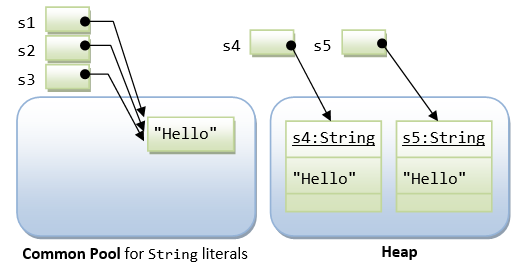

# Objects in Java

Recap: when an object is created in Java, the return value is always a reference pointing to that object, and the **object is always stored in heap**. The reference address can be either stored in stack or heap.

**Warm-up exercise:** If all references have a size of 8 bytes, how much memory space will the following code take to store data?

```Java
int[] arr = new int[8];
```

```Java
double[] arr = new double[8];
```

```Java
int[][] arr_2D = new int[2][];
arr_2D[0] = new int[4];
arr_2D[1] = new int[8];
```

## Objects as function parameters

Some preliminary knowledge: every time we call a function, computer will allocate a new memory space at the bottom of the stack, which can be used to store local variables, input parameters, etc. Thus, when this function is finished, all its local variables stored in the stack will by destroyed and you are no longer able to access it. In contrast, objects are stored on the heap. As long as they are referenced by some variable, they will always be there.

In C++, we can either pass parameters by value or by reference. Almost everything in Java is **pass by value.** For object variables (essentially a reference), we always pass a copy(value) of it. What do I mean exactly by that?

Take a look at the following code:

```java
public class Example {
    public static void main(String[] args) {
        int[] arr = {1, 2, 3};
        increment(arr);
        System.out.println(Arrays.toString(arr)); // Output: [2, 3, 4]
    }
    public static void increment(int[] farr) {
        for (int i = 0; i < arr.length; i++) {
            farr[i]++;
        }
    }
}
```

In this example, an array arr is created with three elements. When the method increment() is called, a reference to the array (arr) is passed by value to farr, and inside the method, each element of the array is incremented by 1. The changes made inside the method affect the original array, and the output of the program is \[2, 3, 4\].

This may seem confusing as why something passed by value can still change something in the main method but let us draw the memory diagram for this:

1.  When `int[] arr = {1, 2, 3}`, we have the following in stack and heap:
    
2.  When `increment(arr)` is called and `farr` is initialized, both reference the same object:
    
3.  When `for-loop` is executed and the values are changed, the changes are reflected in both the array references:
    
4.  After `increment(arr)` finishes execution and `farr` goes out of scope:
    

Another way to think about this is both array references are separate variables but both of them hold the same memory addresses. But they are not aliases of each other (ie: they are both references that occupy separate spots in memory as references):

```
   Stack     |          Heap
+--------+   |   +----------------+
|  arr   |   |   |  array Object  |
+--------+   |   +----------------+
|  0x100 | ----> |    {2,3,4}     |
+--------+   |   +----------------+
             |           ^
+--------+   |           |
|  farr  |   |           |
+--------+   |           |
|  0x100 |---------------+
+--------+   |
```

# String

**String is really special!**

Strings receive *special treatment* in Java, because they are used frequently in a program. Hence, efficiency (in terms of computation and storage) is crucial. For performance reason, Java's `String` is designed to be in between a primitive and an object.

A `String` can be constructed by either

- directly assigning a string *literal* to a `String` reference - *just like a primitive*, or
- via the "`new`" operator and constructor, similar to any other classes.

For example,

```
String str1 = "Java is Hot";           // construction via string literal
String str2 = new String("Java is Awesome");  // construction via new method
```

In the first statement, `str1` is declared as a `String` reference and initialized with a string literal `"Java is Hot"`. In the second statement, `str2` is declared as a `String` reference and initialized via the `new` operator and constructor to contain `"Java is Awesome"`.

## String Literal vs. String Object

As mentioned, there are two ways to construct a string: implicit construction by assigning a string literal or explicitly creating a `String` object via the `new` operator and constructor. For example,

```Java
String s1 = "Hello";              // String literal
String s2 = "Hello";              // String literal
String s3 = s1;                   // same reference
String s4 = new String("Hello");  // String object
String s5 = new String("Hello");  // String object
```



Java has provided a special mechanism for keeping the `String` literals - in a so-called *string common pool*. If two string literals have the same contents, they will share the same storage inside the common pool. This approach is adopted to *conserve storage* for frequently-used strings. On the other hand, `String` objects created via the `new` operator and constructor are kept in the heap. Each `String` object in the heap has its own storage just like any other object.

You can use the method `equals()` of the `String` class to compare the contents of two `String`s. You can use the relational equality operator `'=='` to compare the references (or pointers) of two objects.

```Java
String s0 = "s";
String s1 = "s";
String s2 = new String("s");
System.out.println(s0 == s1); // true, compare reference
System.out.println(s0 == "s"); // true, compare content
System.out.println("s" == "s"); // true, compare content
System.out.println(s0 == s2); // false, compare reference
System.out.println("te" + "st" == "t" + "est") // true, compare reference
System.out.println(88 + "8" + 88 == 888 + “8” + 8) // true or false?
System.out.println(88 + 88 + "8" == 888 + “8” + 8) // true or false?
```