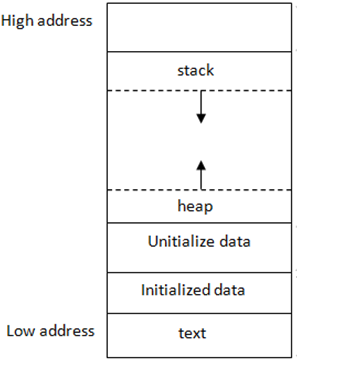

# Memory Layout

In a typical computer system, memory is organized into different segments, with two primary segments being the **stack** and the **heap.**

****

**Stack:**

- The stack is a region of memory that stores data in a last-in, first-out (LIFO) fashion. This means that the most recently added item is the first to be removed.
- It is primarily used for storing function call information (e.g., local variables, function parameters, return addresses). For example, `int a = 0`, and `a` is stored in stack.
- The stack is typically located at the higher addresses and grows downwards.

**Heap**

- The heap is a region of memory used for dynamic memory allocation, where you can allocate memory during runtime.
- It is less structured than the stack and does not have a specific order for allocating or deallocating memory.
- Accessing heap memory involves using pointers to find the specific location of data.
- The heap is typically located at the lower addresses and grows upwards.

# Objects in Java

When an object is created in Java, memory is allocated on the heap to hold the object's data, and the return value is the reference of that object, which is usually stored in stack.

```java
MyClass obj;
obj = new MyClass();
```

The reference variable now points to the memory location of the newly created object on the heap:

```
   Stack               Heap
+--------+      +----------------+
|  obj   |      | MyClass Object |
+--------+      +----------------+
|  0x100 |----> |      data      |
+--------+      +----------------+

```

When the object is no longer needed, it can be garbage collected by JVM automatically and the memory on the heap can be reclaimed:

```java
obj = null;
```

```
   Stack
+--------+
|  obj   |    
+--------+
|  null  |
+--------+
```

In most cases, in Java, references are created on the stack and objects are created on the heap. When an object is created, memory is allocated on the heap to hold the object's data, and a reference variable on the stack is assigned to point to the memory location of the object. When the object is no longer needed, it can be garbage collected and the memory on the heap can be reclaimed.

See `Objects.java`  for examples.

Now, remember that almost everything in Java is **pass by value**. What do I mean exactly by that?

Take a look at the following code:

```java
public class Example {
    public static void main(String[] args) {
        int[] arr = {1, 2, 3};
        increment(arr);
        System.out.println(Arrays.toString(arr)); // Output: [2, 3, 4]
    }
    public static void increment(int[] farr) {
        for (int i = 0; i < arr.length; i++) {
            farr[i]++;
        }
    }
}
```

In this example, an array arr is created with three elements. When the method increment() is called, a reference to the array (arr) is passed by value to farr, and inside the method, each element of the array is incremented by 1. The changes made inside the method affect the original array, and the output of the program is \[2, 3, 4\].

This may seem confusing as why something passed by value can still change something in the main method but let us draw the memory diagram for this:

1.  When `int[] arr = {1, 2, 3}`, we have the following in stack and heap:
    
2.  When `increment(arr)` is called and `farr` is initialized, both reference the same object:
    
3.  When `for-loop` is executed and the values are changed, the changes are reflected in both the array references:
    
4.  After `increment(arr)` finishes execution and `farr` goes out of scope:
    

Another way to think about this is both array references are separate variables but both of them hold the same memory addresses. But they are not aliases of each other (ie: they are both references that occupy separate spots in memory as references):

```
   Stack     |          Heap
+--------+   |   +----------------+
|  arr   |   |   |  array Object  |
+--------+   |   +----------------+
|  0x100 | ----> |    {2,3,4}     |
+--------+   |   +----------------+
             |           ^
+--------+   |           |
|  farr  |   |           |
+--------+   |           |
|  0x100 |---------------+
+--------+   |
```

## Exercise

Finish the method `initializeMatrix` and `transpose` in the following code snippet:

```Java
public class Matrix {
    public static int[][] initializeMatrix(int N) {
        // initialize a N by N matrix
        // value of each element is N * row_index + col_index
        // e.g. when N=3, array should be
        // 0 1 2
        // 3 4 5
        // 6 7 8
        int[][] mat;

        return mat;
    }

    public static void transpose(int[][] mat) {
        // transpose a matrix
        // you can assume mat is a square matrix
    }

    public static void main(String[] string) {
        int N = 4;
        int[][] mat = initializeMatrix(N);
        for (int r = 0; r < N; r++) {
            for (int c = 0; c < N; c++) {
                System.out.print(String.format("%3s", Integer.toString(mat[r][c])));
            }
            System.out.print("\n");
        }

        transpose(mat);
        System.out.println("After transpose...");
        for (int r = 0; r < N; r++) {
            for (int c = 0; c < N; c++) {
                System.out.print(String.format("%3s", Integer.toString(mat[r][c])));
            }
            System.out.print("\n");
        }
    }
}
```