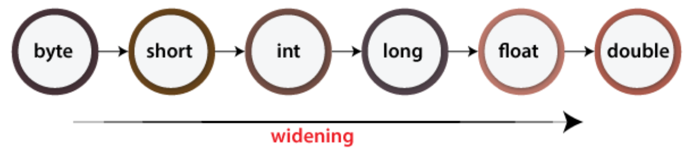

# Review of Conversion



### Widening Conversion

- It occurs when a value of a smaller data type is converted into a larger data type.
- Widening conversion can be performed automatically by the Java compiler because it doesn't result in data loss. This can also be made explicitly.
- For example, converting an `int` to a `double` or a `float` to a `double`.
- For most cases, when doing arithmetic among mixed types, the program will help you do the widening conversion.

### Narrowing Conversion

- It occurs when a value of a larger data type is explicitly converted into a smaller data type.
- Narrowing conversion may result in data loss or loss of precision, so it must be done explicitly with a cast operator.
- For example, converting a `double` to an `int` or a `float` to an `int`.
- When doing narrowing conversion, it's important to make sure the value being used it within the range of target data types. Otherwise the program may give you some unexpected results!

# Variable arguments in Java

Varargs (variable arguments) is a feature introduced in Java 5 that allows methods to accept an arbitrary number of arguments of the same type. With varargs, a method can be called with any number of arguments, including zero.

In Java, varargs are specified using the ellipsis (...) notation. A method that takes varargs must declare the parameter type followed by the ellipsis (...) as the last parameter in the parameter list. For example, the following method takes an array of integers as its argument:

```java
public void printIntegers(int... numbers) {
    for (int number : numbers) {
        System.out.println(number);
    }
}
```

The printIntegers() method can be called with any number of integers, including zero, as follows:

```java
printIntegers(1, 2, 3); // prints 1, 2, 3
printIntegers(); // does not print anything
```

Inside the method, the varargs parameter numbers is treated as an array of integers. Therefore, you can use all the array operations, such as indexing and iteration, to access and manipulate the arguments passed to the method.

It's important to note that when calling a varargs method, you can pass an array of the parameter type instead of individual arguments. For example:

```java
int[] arr = {1, 2, 3};
printIntegers(arr); // equivalent to printIntegers(1, 2, 3)
```

Additionally, a method can have multiple parameters, but only the last one can be a varargs parameter. For example:

```java
public void printStrings(String prefix, String... strings) {
    for (String string : strings) {
        System.out.println(prefix + string);
    }
}

printStrings("Hello, ", "world", "!");
```

In this example, the printStrings() method takes a String parameter prefix and a varargs parameter strings of type String. The method concatenates each string in the strings array with the prefix string and prints the result. The output of the method call is:

```
Hello, world
Hello, !
```

Varargs are a powerful feature that allows methods to be more flexible in the number of arguments they accept, and can make the code more concise and readable.

# Exercises

### Question 1

What is the output of the following snippet?

```java
public class A {
  public static void main(String[] args) {
    // minimum value of int is -2147483648, represented as 100...00
    // maximum value of int is 2147483647, represented as 011...11
    int a = -2147483648; 
    int b = 1;
    int c = a - b;
    int d = c * 2;
    System.out.println(d);
  }
}
```

### Question 2

What is the output of the following snippet?

```java
public class A {
    public static void main(String[] args) {
        int num1 = 5;
        float num2 = 5.0f;
        double num3 = 5.0;
        String num4 = "5";
        
        System.out.println(num1 == num2);
        System.out.println(num2 == num3);
        System.out.println(num3 == Integer.parseInt(num4));
    }
}
```

### Question 3

What is the output of the following snippet?

```java
public class A {
    static int staticVar = 0;
    int instanceVar = 0;
    
    public A() {
        staticVar++;
        instanceVar++;
        System.out.println("staticVar: " + staticVar);
        System.out.println("instanceVar: " + instanceVar);
    }
    
    public static void main(String[] args) {
        A a1 = new A();
        A a2 = new A();
    }
}
```

### Question 4

What is the output of the following snippet?

```java
import java.util.*;

public class App {

    public void print(int x) {
        System.out.println("int: " + x);
    }
    
    public void print(double x) {
        System.out.println("double: " + x);
    }
    
    public void print(String x) {
        System.out.println("String: " + x);
    }
    public void print(float[] x) {
        System.out.println("float[]: " + Arrays.toString(x));
    }

    public void print(double x, double y, double z) {
        System.out.println("double: " + x + ", int: " + y + ", double: " + z);
    }

    public void print(double x, int y, int z) {
        System.out.println("double: " + x + ", int: " + y + ", int: " + z);
    }

    public static void main(String[] args) {
        App puzzle = new App();
        
        puzzle.print(3+2+"1"+4+"1"+1+4);
        puzzle.print(new float[] {1, 2, 3});
        puzzle.print(10.0, 1, 'c');
        puzzle.print(10.0, 1.5, 'c');
        puzzle.print(1.23f);
    }
}
```

### Question 5

What is the output of the following snippet?

```java
public class App {
    public static void main(String[] args) {
        int[] arr = {1, 2, 3, 4, 5}; //
        int sum = 0;
        for (int i = 0; i < arr.length; i++) {
            arr[i]+=2;
            sum += arr[i];
        }
        System.out.println("Sum is : " + sum);
        
        sum = 0;
        for (int num : arr) {
            num+=2;
            sum += num;
        }
        System.out.println("Sum is : " + sum);

        sum = 0;
        for (int i = 0; i < arr.length; i++) {
            arr[i]+=2;
            sum += arr[i];
        }
        System.out.println("Sum is : " + sum);
    }
}
```

### Question 6

What is the output of the following snippet?

Draw the memory diagram of the references and the objects as well

```java
import java.util.*;
public class App {
    public static void main(String[] args) {
        String[] arr1 = {"one", "two", "three"};
        String[] arr2 = {"four", "five", "six"};
        
        modifyArray(arr1, arr2);
        
        System.out.println("Array 1: " + Arrays.toString(arr1));
        System.out.println("Array 2: " + Arrays.toString(arr2));
    }
    
    public static void modifyArray(String[] a, String[] b) {
        a = new String[3];
        a[0] = "seven";
        a[1] = "eight";
        a[2] = "nine";
        
        b[0] = "ten";
        b[1] = "eleven";
        b[2] = "twelve";
    }
}
```

### Question 7

What is the output of the following snippet?

Draw the memory diagram of the references and the objects as well

```java
import java.util.*;
public class App {
    public static void main(String[] args) {
        String s = "Hello";
        char[] c = {'H', 'e', 'l', 'l', 'o'};
        
        modifyString(s);
        modifyArray(c);
        
        System.out.println("String: " + s);
        System.out.println("Array: " + Arrays.toString(c));
    }
    
    public static void modifyString(String str) {
        str = "World";
    }
    
    public static void modifyArray(char[] arr) {
        arr[0] = 'W';
        arr[3] = 'd';
    }
}
```