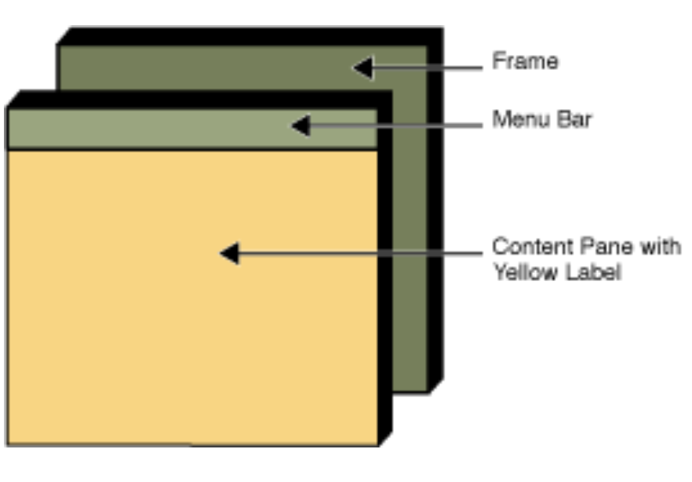

# JFrame

JFrame is  a Top-level containers, which is essentially a window. JFrame consists of a content pane and a menu bar.



GUI components are added to a JFrame via Content Pane.

We can add components to a JFrame via its Content Pane:

```Java
JFrame frame = new JFrame("Hello Swing"); 
Container contPane = frame.getContentPane(); 
contPane.add(new JLabel("Hello World"));
```

Java makes life easier: we can add GUI components directly to a JFrame:

```Java
frame.add(new JLabel("Hello World"));
```

Below is some commonly used methods of JFrame:

- **setVisible(boolean)**
    
- **add(Component)**
    
- **setSize(int width, int height)**
    
- **pack()**: resize the JFrame to fit a preferred size and layout of its sub-components.
    
- **setResizable(boolean)**
    
- **setDefaultCloseOperation(JFrame.EXIT\_ON\_CLOSE)**: program is terminated when the JFrame is closed.
    

# JPanel

JPanel is a container, but not a top-level (i.e. not a window). Usually we first have GUI components added to JPanels, an then add these JPanels to a JFrame.

```Java
JFrame frame = new JFrame("MyFrame"); 
JPanel panel = new JPanel (); 
panel.add(new JButton("Button 1"));
frame.add(panel);
```

JPanel is a subclass of JComponent. Some commonly used methods of JPanel:

- **setPreferredSize(Dimension preferredSize)**: Sets the preferred size of this component.
- **setBackground(Color bg)**: Sets the background color of this component.
- **add(Component comp)**: Adds the specified component to the end of this container.
- **paintComponent(Graphics** **g)**:  Performs custom painting as desired.


To build a graphical user interface (GUI), you need to

- create components,
    
- lay out the components, and
    
- make the components do useful things.
    

# Basic JComponents

JComponents are basic elements of a GUI.

## JLabel

Use JLabel to display a text and/or an image. The text and image are unselectable.

```Java
public static void main(String[] args) { 
    ...
    JLabel label = new JLabel("UCLA logo");
    // icon is loaded from a local file
    // setIcon takes in Icon and displays it
    Icon icon = new ImageIcon("ucla.jpg"); 
    label.setIcon(icon); 
    
    // These set the text position with respect to the icon
    label.setVerticalTextPosition(JLabel.BOTTOM); 	
    label.setHorizontalTextPosition(JLabel.CENTER); 
    frame.add(label);
    ...
}
```

class `javax.swing.ImageIcon` represents icons from images.

Can you add an ImageIcon directly to a content pane?

## JPanel

`javax.swing.JPanel` is a general purpose lightweight container.

```Java
JPanel panel1 = new JPanel (); 
panel1.add(new JLabel("Label in panel1")); 
frame.getContentPane().add(panel1, BorderLayout.CENTER);
JPanel panel2 = new JPanel (); 
panel2.add(new JLabel("Label in panel2")); 
frame.getContentPane().add(panel2, BorderLayout.SOUTH);
```

The `BorderLayout.CENTER` and  `BorderLayout.CENTER` helps you to manage the position of these two panels. If you don't add these two parameters, `panel2` may be overlaid on the top of `panel1`. We are going to discuss more about `BorderLayout` later.

You can also set the background color of a JPanel like this:

```Java
JPanel panel2 = new JPanel (); //Color.YELLOW is a constant of class Color 
panel2.setBackground(Color.YELLOW);
```

### Nested JPanels

JPanels can be nested, meaning you can add a JPanel as a component of another JPanel.

```Java
JPanel panel1 = new JPanel();
JPanel panel2 = new JPanel();
JPanel panel3 = new JPanel();

panel1.setBackground(Color.BLUE);
panel2.setBackground(Color.YELLOW); 
panel3.setBackground(Color.RED);

panel1.add(new JLabel("Label in panel1"));
panel2.add(new JLabel("Label in panel2")); 
panel3.add(new JLabel("Label in panel3"));

frame.getContentPane().add(panel1); 
panel1.add(panel2); 
panel2.add(panel3);
```

Here is the figure illustrating the relationship between different components for the above code.


### Custom JPanels

One can design custom JPanels by overriding  `paintComponent` method, where  `java.awt.Graphics` can to used to draw different types of shapes. To draw something, you need to:

- Set the color and the properties of the draw, and then draw.
    
- “Draw Methods” draws the border. “Fill Methods” fills the interior of the shape.
    
- The x-coordinate goes from left to right. The y-coordinate goes from top to bottom.
    


## JButton

Used to create an interactive button on which users can click. It's typically used to trigger some action. The methods of JButton are pretty similar to JLabel

- **Constructors**: `JButton` provides several constructors, allowing you to create buttons with text labels, icons, or both. Common constructors include:
    
    - `JButton()`: Creates a button with no text or icon.
    - `JButton(String text)`: Creates a button with text.
    - `JButton(Icon icon)`: Creates a button with an icon.
    - `JButton(String text, Icon icon)`: Creates a button with both text and icon.
- **Setting Text and Icons**: You can set or change the text and icons of a `JButton` using methods like `setText(String text)` and `setIcon(Icon icon)`.
    

But one important feature of JButton is that we can **ActionLisenter** to it so that we can expect something to be triggered when we click the button, e.g. a new window pops up.

# Layout Manager

In Java Swing, layout managers are responsible for arranging components in a container (like `JFrame`, `JPanel`, etc.). Each layout manager has its own rules for positioning and sizing components.

Below are some most commonly used layout managers in Swing:


### 1\. BorderLayout

- **Description**: Arranges components in five areas: north, south, east, west, and center. Each area can contain only one component.
- **Example**: `new BorderLayout()`

### 2\. FlowLayout

- **Description**: Places components in a row, aligned at their center. When the row is full, it moves to the next line.
- **Example**: `new FlowLayout()`

### 3\. GridLayout

- **Description**: Lays out components in a grid of cells, with each cell being the same size. The grid is defined by a specified number of rows and columns.
    
- **Example**: `new GridLayout(rows, cols)`. You can set horizonal and vertical gap by using constructor `GridLayout(int rows, int cols, int hgap, int vgap)`
    

By default, JPanels use `FlowLayout` and content panes use `BorderLayout`.

If you want to set a JPanels's layout, you can do it in its constructor:

```Java
JPanel panel = new JPanel(new BorderLayout());
```

You can later set a Container’s layout manager using `setLayout`:

```Java
Container contentPane = frame.getContentPane(); 
contentPane.setLayout(new FlowLayout());
```

One can also use  `javax.swing.BorderFactory` to create borders for JPanels and JLabels:

```Java
JPanel panel1 = new JPanel (); 
panel1.setBorder(BorderFactory.createLineBorder(Color.RED));
```